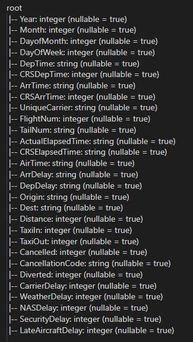
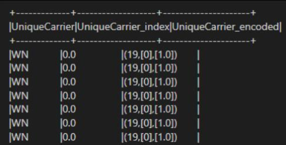

# Big Data Sparks: Expo 2009 Airline Time
This Project was done with [@Anas-ElHounsri](https://github.com/Anas-Elhounsri) and [@Mlpalacios8](https://github.com/Mlpalacios8).

What you are about to read is a comphrensive summary of the data processing and data science techniques applied to the given dataset, as well as the results of our Machine Learning implementation.

This is a Big Data project were we predict the possible time delay for flights using the [Data Expo 2009: Airline](https://dataverse.harvard.edu/dataset.xhtml?persistentId=doi:10.7910/DVN/HG7NV7) dataset.
## Variables used:
The dataset originally contains these variables:

Following a comprehensive analysis of the dataset, we have strategically identified a set of numerical and categorical variables to serve as the foundation for our Machine Learning algorithms, we decided to keep some variables and exclude some, we end up with these selection:

* __Numerical Variables:__ "Month", "DayofMonth", "DayOfWeek", "DepTime", "CRSDepTime", "CRSArrTime", "DepDelay", "TaxiOut".
* __Categorical variables:__  "UniqueCarrier", "Origin", "Dest".

And our target variable would be __ArrDelay__.

We had to specifically remove a set of variables because they contain information that is unknown at the time the plane takes off and, therefore, cannot be used in the prediction model. 
these variables are: __"ArrTime", "ActualElapsedTime", "AirTime", "TaxiIn", "Diverted" "CarrierDelay", "WeatherDelay", "NASDelay", "SecurityDelay","LateAircraftDelay"__.

As for the rest of the variables, we removed and filtered them due to their insignificance, or due to high correlation which can greatly affect our Machine Learning models.

these variables are:

* __Numerical variables:__ "Distance", "CRSElapsedTime", "Cancelled", "year".
* __Categorical variables:__ "FlightNum", "TailNum" "CancellationCode".

## Handeling Categorical Variables:

In order to construct an effective machine learning model for predicting flight arrival delays, including the
categorical variables that were selected is imperative, but in order to make them useful for our model, we
decided to __One-Hot Encode__ them, specifically __Sparse One-Hot encoding__ This technique proved
instrumental in generating new, meaningful variables. 

An example of the resulting matrices for the encoded variables are as follow:

More about it in the commented code.

## Exploratory Data Analysis, Univariate Analysis, Multivariate Analysis:

__In exploratory data analysis__, we applied a summary function to the dataset after processing. We could
observe that the response variable, ArrDelay, has a gaussian/normal distribution which is important when
evaluating our model, based on its standard deviation, quartiles, mean and median.
* __In univariate analysis__, we applied the __UnivariateFeatureSelector__ to the numeric features with a
selection mode of “fpr” which chooses all features whose p-values are below a threshold (0.05),
thus controlling the false positive rate of selection. All variables passed the threshold, so
everything was retained.

* __In multivariate analysis__, we generated a __Pearson correlation matrix__ with the numeric features
and observed that all values were closed very close to 0, meaning that all numeric variables were
not correlated between them, proving that all of them are useful for modeling.

## Machine Learning Model and Validation:
### Linear regression:
We used a GeneralizedLinearRegression function with the parameter family “gaussian”, because
our target variable has a normal distribution, and a parameter link “identity” which stands for a normal
linear regression. The model was implemented with the following: 

* Train/test split without hyperparameters tuning. 
* Train/test split with hyperparameter tuning. 

We obtained very good results:
* Linear Regression - Root Mean Squared Error (RMSE) on test data = __9.872014972157567__
* Linear Regression - Mean Absolute Error (MAE) on test data = __6.810481148590552__
* Linear Regression - R-squared (R2) on test data = __0.888515268971845__

### Decision Tree Regression and Random Forest Regress:

Our second and third model is the Decision Tree Regression and Random Forest Regression models, still
targeting our continuous variable. No cross validation or hyperparameter tuning was done in these models
as the resources required were very hefty.

Results were less favourable compared to the Linear Regression model:

For Decision Tree Regression:

* Decision Tree Regression - Root Mean Squared Error (RMSE) on test data = __17.34322337849847__
* Decision Tree Regression - Mean Absolute Error (MAE) on test data = __9.341473382646026__
* Decision Tree Regression - R-squared (R2) on test data = __0.6559168422044535__

For Random Forest Regression:

* Random Forest Regression - Root Mean Squared Error (RMSE) on test data = __18.15972147123311__
* Random Forest Regression - Mean Absolute Error (MAE) on test data = __10.40378010532508__
* Random Forest Regression - R-squared (R2) on test data = __0.6227561695039323__

As observed, Random Forest didn't provide an improvement over Decision Tree. Results were fairly
similar and poorly performed vs linear regression, especially the R-squared (R2) with 0.6559 vs 0.8885.

## How to Run The Application:
Run the following command to install the required dependencies using ‘pip’:

* `pip install -r requirements.txt`
  
* Download the '2007.csv' data file and place it in the project directory.
  
* You need to make sure that “big_data.py” and “2007.csv” are in the same folder.
  
* Execute the Spark script using the following command:
    
    `spark-submit --master local[*] big_data.py`
